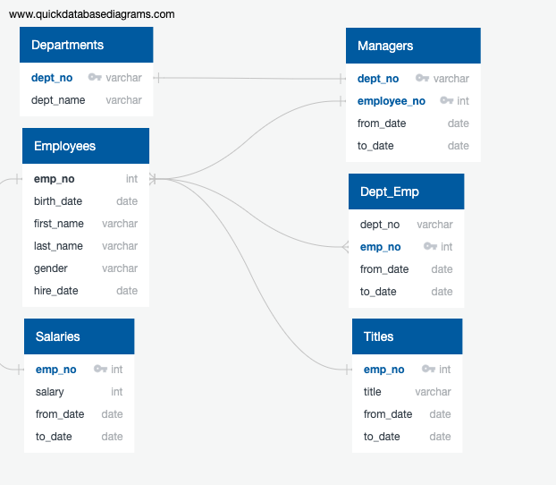
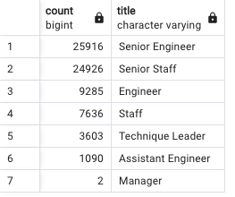
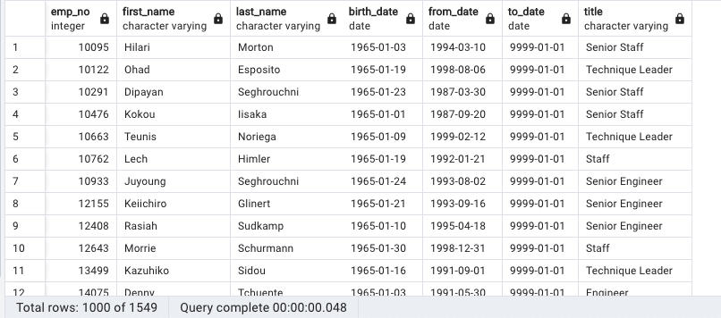

# Pewlett-Hackard-Analysis
## Background

**PART 1**

Pewlett Hackard is a large company boasting several thousand employees, and it's been around for a long time. As baby boomers begin to retire at a rapid rate, Pewlett Hackard is looking toward the future in two ways. First, it's offering a retirement package for those who meet certain criteria. Second, it's starting to think about which positions will need to be filled in the near future. The number of upcoming retirements will leave thousands of job openings. 

As an HR analyst, the task is to perform employee research. Pewlett Hackard has been mainly using Excel and VBA to work with their data, but they have decided to update their methods to use SQL, a definite upgrade considering the amount of data. We started by building an employee database with PostgreSQL by applying data modeling, engineering, and analysis skills, using 6 imported CSV files. 

Additionally, an entity relationship diagram (ERD) has been created as a guide for how to accurately pull the disparate rows and columns from the 6 files into singular new tables and lists in Postgres for the analysis:

Key new tables and lists created using SQL include:
* Active employees names eligible for retirement (those born between 1952 and 1955 and who were hired between 1985-1988). The result totals 33,118 employees (current_emp.csv).
* Active employees names who are eligible for retirement, listed by dept, their gender and their salaries (emp_info.csv).
* Employee count by department (emp_count_by_dept.csv).

**PART 2**

In light of the initial analysis (Part 1), management has decided they want to create a mentorship program for employees getting ready to retire. Instead of having a large chunk of their workforce retiring, they want to introduce a mentoring program: experienced and successful employees stepping back into a part-time role instead of retiring completely. Their new role in the company would be as a mentor to the newly hired folks. 

The next steps are to:

* Find the number of retiring employees by title.
* Create a table that holds the employees eligible for the mentorship program (those born in 1965).
* Deliver a report summary to help management prepare for the "silver tsunami" as many current employees reach retirement age.

**Results:**

* The below table summarizes the number of retiring employees by title: 

* The below table shows that there are a total of 1,549 current employees eligible for the mentorship program:

* 

## Summary

